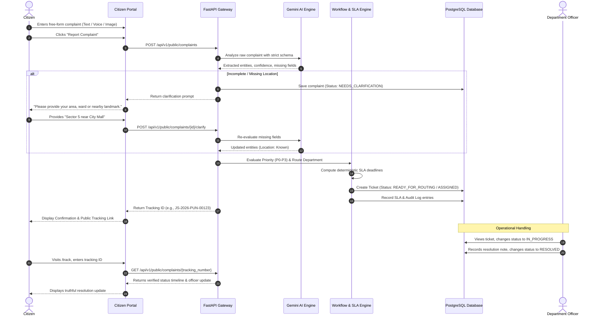

# JanSetu AI — Application Flows & User Journeys

This document outlines the end-to-end user journeys for each actor within the JanSetu AI ecosystem.

---

## 1. Citizen Journey: Grievance Submission to Resolution



---

## 2. Official Access Journey: Unified Login & Server-Side Routing

```mermaid
flowchart TD
    Start([User clicks 'Official Access']) --> LoginUI[/login Form]
    LoginUI --> InputCreds[Enter Employee ID / Email & Password]
    InputCreds --> Submit[Click 'Sign In']
    Submit --> APIAuth[POST /api/v1/auth/login]
    
    APIAuth --> VerifyCreds{Verify Credentials & Password Hash}
    VerifyCreds -- Invalid --> Return401[Return 401 Unauthorized]
    Return401 --> LoginUI
    
    VerifyCreds -- Valid --> FetchRole[Retrieve User Role & department_id from DB]
    FetchRole --> SignJWT[Issue Signed JWT with Role & Department Claims]
    SignJWT --> ClientRedirect[Return Token to Frontend]
    
    ClientRedirect --> RoleRouter{Backend Verified Role}
    RoleRouter -- MUNICIPAL_ADMIN --> AdminRoute[/admin Command Center]
    RoleRouter -- DEPARTMENT_OFFICER --> DeptRoute[/department Dashboard]
    RoleRouter -- COLLECTOR --> CollectorRoute[/collector Intelligence]
```

*Architectural Principle: Zero client-side role selection. Post-login destination is strictly governed by the cryptographically signed backend payload.*

---

## 3. Department Officer Journey

1. **Authentication**:
   - Officer logs in at `/login`.
   - Backend recognizes role `DEPARTMENT_OFFICER` and `department_id = WATER_SUPPLY`.
   - Frontend automatically routes to `/department`.
2. **Queue Inspection**:
   - Officer views assigned Water Supply grievances ordered by SLA urgency and priority.
   - P0 safety hazards appear pinned at the top with crimson visual alerts.
3. **Ticket Deep-Dive & AI Assistance**:
   - Officer selects ticket `JS-2026-PUN-00123`.
   - Views AI extraction: Issue (*Water Supply Outage*), Duration (*3 days*), Location (*Sector 5*).
   - Reviews AI Recommended Standard Operating Procedures:
     1. Verify local booster pump pressure.
     2. Inspect main feeder line valve at Sector 5 junction.
     3. Dispatch mobile water tanker if repair exceeds 6 hours.
4. **Action & Resolution**:
   - Officer changes ticket status to `IN_PROGRESS` (system starts tracking active work time).
   - Once repairs are complete, officer inputs official resolution notes: *"Valve replaced at Sector 5 crossroad. Water pressure restored."*
   - Officer clicks `Mark as Resolved`.
   - Deterministic SLA engine stops resolution timer, records `status = RESOLVED`, and logs an immutable audit event.
5. **Exception Handling**:
   - If work requires heavy machinery or inter-department assistance, officer clicks `Escalate`, providing operational reasoning.
   - Ticket enters `ESCALATED` state and alerts Municipal Admin and Collector.

---

## 4. Municipal Admin Journey: City Command Center

1. **Global Situation Overview (`/admin`)**:
   - Admin reviews total complaint volume across Pune City.
   - Monitors live department breakdown cards:
     - Water Supply: 328 open | 94% within SLA
     - Road: 512 open | 82% within SLA (Amber Alert)
     - Waste Management: 421 open | 96% within SLA
2. **Department Operational Drill-Down (`/admin/departments/road`)**:
   - Admin filters directly into Road Department grievances.
   - Identifies high concentrations of pothole reports in Kothrud ward.
3. **Misrouting Correction**:
   - Discovers a street drainage complaint misclassified as Road rather than Public Health.
   - Clicks `Re-route Department`, selects `PUBLIC_HEALTH`, and provides note *"Stormwater drain blockage requires Public Health sanitation crew."*
   - Backend updates `ticket.department_id`, creates audit record, and updates department queue counters.
4. **Incident Confirmation (`/admin/incidents`)**:
   - Reviews system-generated candidate: *"Suggested Incident: Sector 5 Water Outage (37 complaints linked)"*.
   - Verifies geographic clustering on the embedded map.
   - Clicks `Confirm & Link Complaints`. System clusters complaints under one master incident without silently deleting or modifying individual citizen tracking IDs.

---

## 5. Collector Journey: Executive Oversight & Intelligence

1. **Executive Briefing (`/collector`)**:
   - Reviews high-impact civic indicators: Active P0 emergencies, SLA breaches in the last 24 hours, and systemic failure hotspots.
2. **Critical Cases Monitoring (`/collector/critical`)**:
   - Reviews all active P0 (Emergency) and P1 (High Impact) incidents across the city.
   - Validates that emergency response teams have been dispatched for life-safety reports (e.g., live electrical wires near schools).
3. **Inter-Department Performance Review (`/collector/departments`)**:
   - Compares 8 PMC departments on resolution speed, recurring backlog, and SLA compliance percentages.
   - Flags departments consistently falling below municipal SLA thresholds.
4. **Systemic Issue Detection (`/collector/analytics`)**:
   - Reviews AI-identified recurring patterns: e.g., Ward 7 experiencing water supply disruption for the 4th time this month.
   - Directs long-term capital maintenance orders to municipal engineers.
